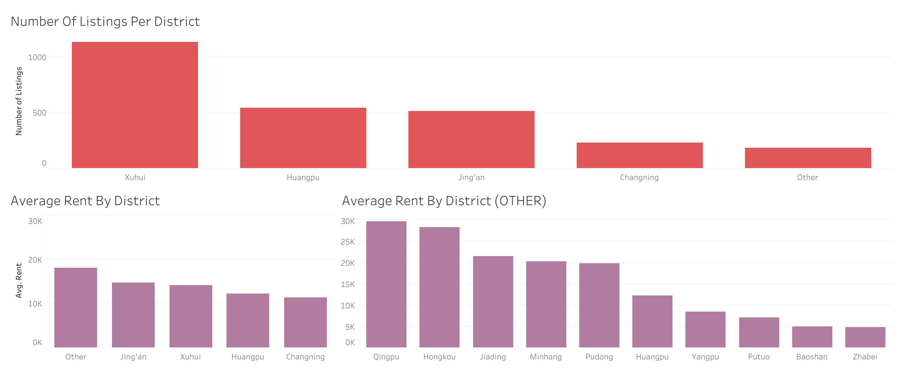

# Exploratory Data Analysis of Shanghai Expat Rental Market

I scraped over 2000 pages of listings from the public listing website [jiazaishanghai](www.jiazaishanghai.com). Of the listings I gathered, I isolated listings that were for residential or mixed (residential/office) use; listings that were classified as attached lane houses, detached lane houses, public housing, or villas. I removed all listings appeared to have fake or inaccurate information. Lastly, I formatted all the addresses to prepare for geocoding.

In Tableau I have created the below three visualizations:

As sceen in the top bar chart, majority of the listings are located in Xuhui district. This is intuitive knowing the layout of the city. The "Former French Concession", the neighborhood known for its quaint winding streets and European style lane houses, is located in Xuhui.

However, if we look at the average rent by district, the highest average rents are in Qingpu, Hongkou, Jiading, Minhang, and Pudong. I am considering removing the "villa" category to see if that changes anything or clears things up.

I have also created dummy variables for the categorical data that I collected. I would like to run a simple multiple linear regression model to see if the coefficients could reveal a bit more about feature importance/rent pricing.